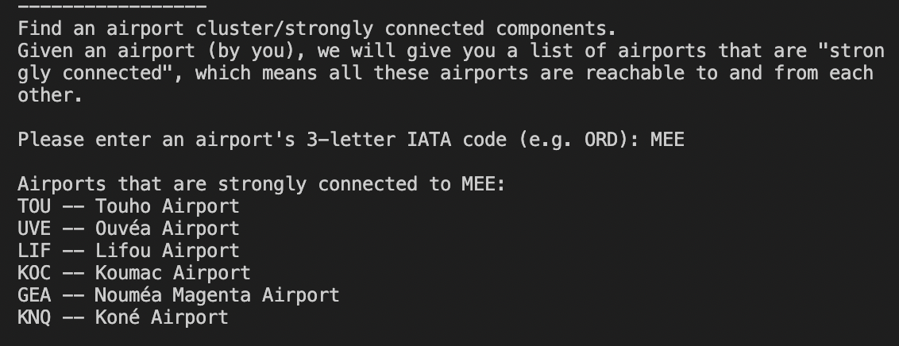

# CS225 Final Project Written Report

## Project Goal #1: Find Shortest Routes Between 2 Airports (Dijkstra's algorithm)
### Implementation
Our Dijkstra's algorithm uses heap in O(E LogV). By using the priority queue, we can manage the vertex (airport) with weight (distance) in increasing order. To get the shortest path, whenever the distance of a vertex is reduced, we add one more instance of a vertex in priority_queue. We only consider the instance with minimum distance and ignore other instances.
### Output: 
The Dijkstra class contains two functions which are shortestpath and getroute. 

The shortestpath function will return the shortest distance between two airports with two parameters which are the start point and the destination (in int). 

The getroute function will return a vector of int which represents the airports that we need to reach if we want the shortest path.

### Correctness/Testings
In order to make sure the algorithm works correctly, we check the direct flight and the flight with tranfers. The distance between two airports can be simply got from the adjacency list which is made in the Graph class. If the value get by the shortestpath function is the same as the value get from the adjacency list, it means the function is correct. To check the getroute function, we can first check the start point and the destination are correct. And for the airports in between, we can use the adjacency list to get the shortest distance to check if they are matched.

---
## Project Goal #2: Find Airport Cluster (Tarjan's strongly connected components algorithm)
### Implementation
Our Tarjan's algorithm uses DFS to traverse through the graph. Upon visiting a node, we add the node into a stack, and set its "low" value equal to its id (low is stored as a vector).

When we get to a visited node, and the node is also on stack, we backtrack and reassign the "low" value to minimum. 

When the current node has visited all its neighbors and its "low" value equal to its id, one strongly connected component is found. 

### Output: 
This is how it looks like in terminal, when finding the airports strongly connected to MEE (Maré Airport): 

If the output has more than 10 airports, the result will be in a new text file called scc-output.txt for better readability.

### Correctness/Testings
We made sure the algorithm works as expected by taking two random nodes in the same strongly connected component, and use a method in Dijsktra.cpp to calculate their distance. If the distance is infinity, the two nodes can't reach each other, which means the algorithm is incorrect because every node in a strongly connected componenet should be able to reach every other nodes in the same component. Our test cases proved that our implementation is correct. 

### Depth-first search (DFS)
Since the Tarjan's algorithm is based on DFS, we combined the code for Tarjan algorithm and DFS together, both in [`Tarjan.cpp`](https://github.com/stacey0331/cs225-final-project/blob/master/open-flight/src/Tarjan.cpp). We go though each node's adjacency nodes first before visiting the next, and mark nodes as visited or unvisited using vectors. 
